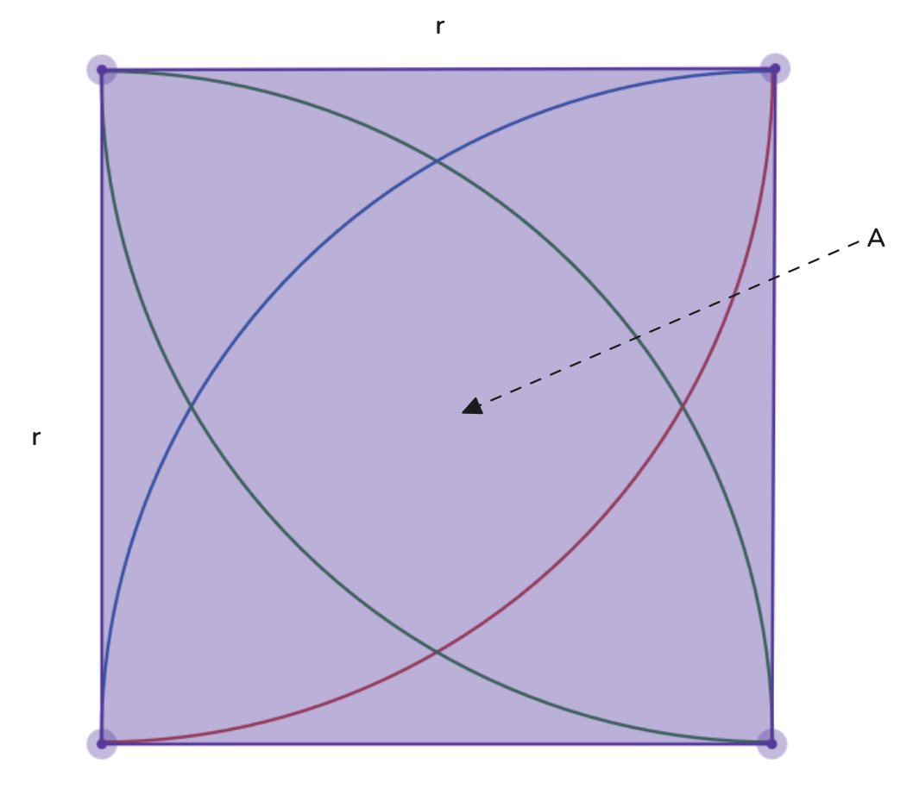
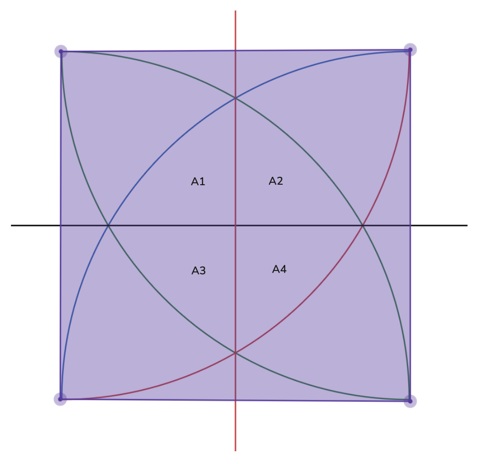
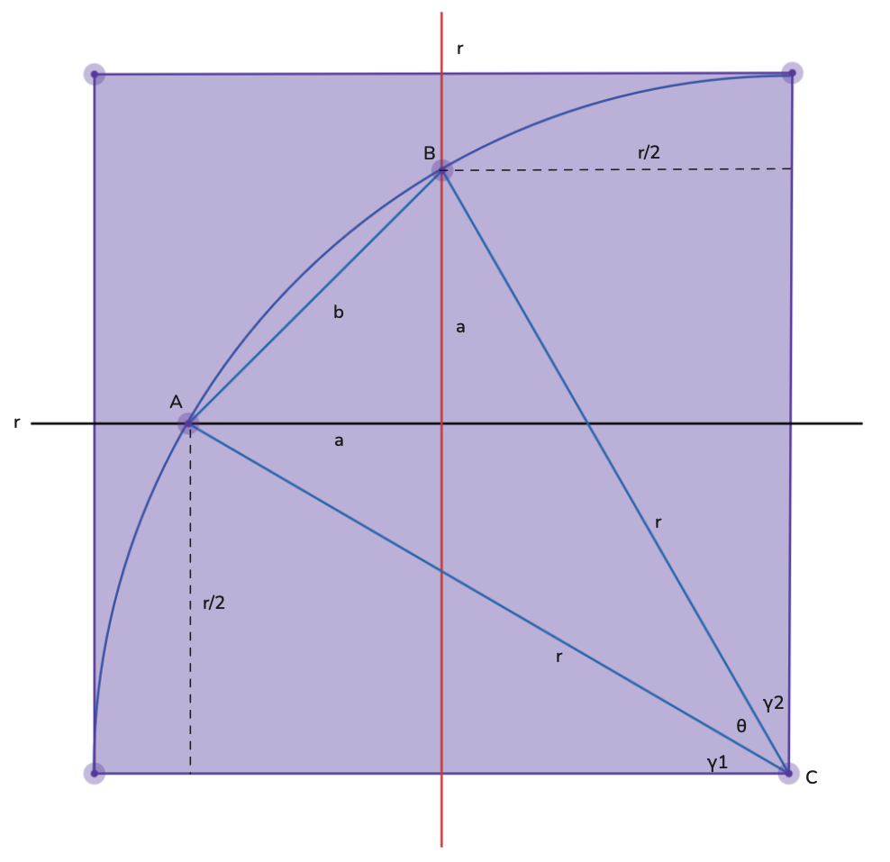

import { Image } from "astro:assets";

Circles captivate us, and inscribed circles doubly so. In [a previous post](/posts/inscribed-circles), we tackled finding the area of a shaded region. Today we pursue a similar goal with a twist.

Here we have an $r \times r$ square containing four inscribed circles, each also of radius $r$. Our mission: find the total area of that diamond-shaped region nestled in the center.

While numerical integration could solve this, we'll take the geometric route. Our focus here is building intuition and strategy, not wrestling with integrals.

## Oh Geometry!

When tackling geometric puzzles, I like to inventory what we already know and build from there.

Our toolkit includes familiar formulas: squares have area $r^2$, circles have area $\pi r^2$, and triangles with base $b$ and height $h$ have area $\frac{1}{2}bh$. From our previous exploration, we also have a formula for the area of a chord segment that depends on the subtended angle $\theta$ and radius $r$—let's call this $A_{\text{chord}}(r, \theta)$.

Time to $R3$ this problem[^1]. Consider the following decomposition:

[^1]: If you've forgotten, this stands for **reject**, **reframe**, and **reduce** and should be read in the same spirit as ["gaslight, gatekeep, girlboss"](https://www.reddit.com/r/NoStupidQuestions/comments/pwi7ar/what_the_hell_does_gaslight_gatekeep_girlboss_mean/).

We've divided our diamond into four equal[^2] curved triangles, each bounded by its corresponding circle.

[^2]: Symmetry guarantees equality—the diamond mirrors the square's symmetry, and we've partitioned the square into four equal $\frac{r}{2} \times \frac{r}{2}$ regions.

$$
\text{Area} = A_1 + A_2 + A_3 + A_4
$$

Since these areas are equal, we need only compute $A_1$ and multiply by four. Let's zoom in on $A_1$—the diagram below looks complex at first, but will clarify our approach.

I've isolated the curve corresponding to $A_1$ and added sector $ABC$ for reasons that will soon become apparent. Our target region sits in the upper-left quadrant.

From the diagram, $A_1$ equals the area of chord segment $AB$ plus the triangular area $\frac{a^2}{2}$.

For the area of chord segment $AB$, we recall from our [previous post](/posts/inscribed-circles):

$$
A_{\text{chord}}(r, \theta) = \frac{1}{2}r^2 \left( \theta - \sin\theta \right)
$$

where $\theta$ (in radians) is the angle subtended by chord $AB$ at the circle's center.

Therefore:

$$
\begin{align}
A_1 = \frac{a^2}{2} + A_{\text{chord}}(r, \theta) \\
A_1 = \frac{a^2}{2} + \frac{1}{2}r^2 \left( \theta - \sin\theta \right)
\end{align}
$$

Now we face a choice: equation $(2)$ involves both $a$ and $\theta$. To get a single-variable function $A_1(\cdot)$, which should we eliminate?

From the diagram, $\theta$ appears more tractable. It's constrained by $\theta + \gamma_1 + \gamma_2 = \frac{\pi}{2}$; the angles at the square's corner sum to a right angle.

So we'll express $a$ in terms of $\theta$. Fortunately, the geometry cooperates: $a$ relates to $b$ via Pythagoras, and $b$ connects to $\theta$ and $r$ through sector $ABC$.

$$
\begin{align}
a &= \frac{b}{\sqrt{2}} \\
b &= 2r\sin\left(\frac{\theta}{2}\right)
\end{align}
$$

Equation $(4)$ follows from $\sin\left(\frac{\theta}{2}\right) = \frac{b}{2r}$.

Substituting into equation $(2)$:

$$
\begin{align}
A_1(\theta) &= \frac{a^2}{2} + \frac{1}{2}r^2 \left( \theta - \sin\theta \right) \\
&= \frac{\left(\frac{b}{\sqrt{2}}\right)^2}{2} + \frac{1}{2}r^2 \left( \theta - \sin\theta \right) \\
&= \frac{b^2}{4} + \frac{1}{2}r^2 \left( \theta - \sin\theta \right) \\
&= r^2\sin^2\left(\frac{\theta}{2}\right) + \frac{1}{2}r^2 \left( \theta - \sin\theta \right) \\
\end{align}
$$

Excellent! Now $A_1$ depends only on $\theta$.

## The Final Stretch

Nearly there! The diagram suggests $\theta$ has a fixed value. Returning to the square's bottom-right corner, we have $\theta + \gamma_1 + \gamma_2 = \frac{\pi}{2}$.

Both $\gamma_1$ and $\gamma_2$ are determined by right triangles with hypotenuse $r$ and shorter leg $\frac{r}{2}$. Basic trigonometry gives:

$$
\gamma_1 = \arcsin\left(\frac{r/2}{r}\right) = \arcsin\left(\frac{1}{2}\right) = \frac{\pi}{6}
$$

By symmetry:

$$
\gamma_2 = \arcsin\left(\frac{1}{2}\right) = \frac{\pi}{6}
$$

Now we can find $\theta$:

$$
\begin{align}
\theta &= \frac{\pi}{2} - \gamma_1 - \gamma_2 \\
&= \frac{\pi}{2} - \frac{\pi}{3} \\
&= \frac{\pi}{6}
\end{align}
$$

Substituting $\theta = \frac{\pi}{6}$ into equation $(8)$:

$$
\begin{align}
A_1 &= r^2\sin^2\left(\frac{\theta}{2}\right) + \frac{1}{2}r^2 \left( \theta - \sin\theta \right) \\
&= r^2\sin^2\left(\frac{\pi}{12}\right) + \frac{1}{2}r^2 \left( \frac{\pi}{6} - \sin\frac{\pi}{6} \right) \\
&= r^2\left(\sin^2\left(\frac{\pi}{12}\right) + \frac{\pi}{12} - \frac{1}{2}\sin\frac{\pi}{6}\right) \\
\end{align}
$$

The diamond's total area is simply four times $A_1$:

$$
\text{Area} = 4A_1 = 4r^2\left(\sin^2\frac{\pi}{12} + \frac{\pi}{12} - \frac{1}{2}\sin\frac{\pi}{6}\right) \square
$$

## Mission Accomplished

We've found our diamond's area! The result depends only on $r$ and scales quadratically—exactly what we'd expect. As a sanity check, try plotting this for $r=1$ in [Desmos](https://www.desmos.com/calculator) and count grid squares[^3].

[^3]: Challenge: define one function $f_1(x)$ for a single curve, then construct the other three using transformations like $f_2(x) = f_1(x) + r$.

A delightful discovery: our angle $\theta$ always equals $\frac{\pi}{6}$, independent of $r$. This geometric invariant elegantly confirms that our area formula depends solely on the radius.

Thanks for reading!