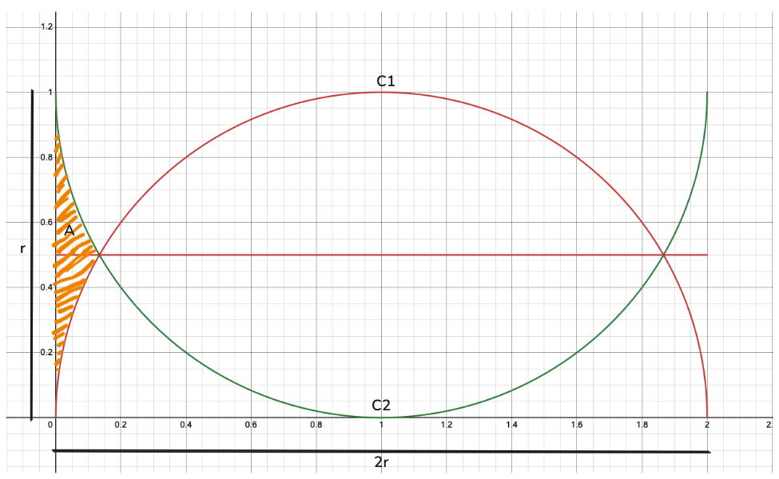
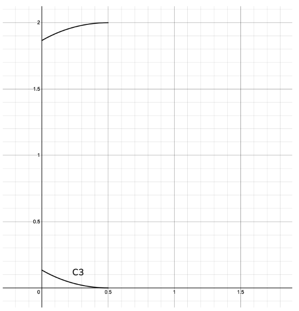
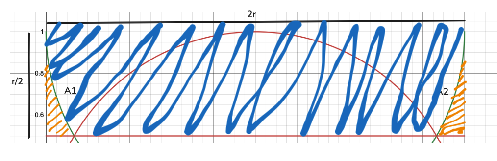
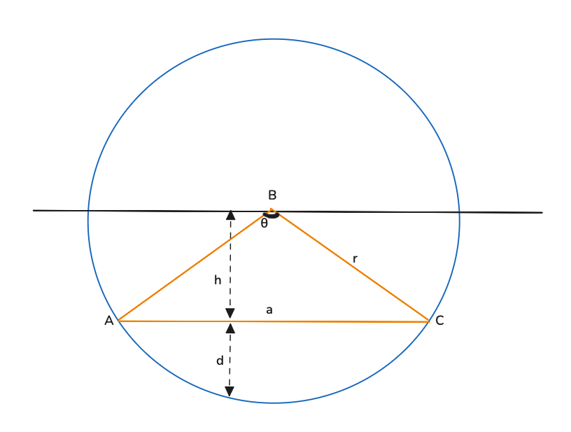

import { Image } from "astro:assets";

I was given an interesting math problem on a post-it note recently. The setup is pictured below: two circles (of radius $r$) are inscribed within a $2r \times r$ rectangle. I've chosen, without loss of generality, $r = 1$.

The goal is to find the total area of the shaded region, which is the curved, sloping triangle to either side of the circles. This can be considered to be the complement of the union in area of the two circles (within the *universe* of the $2r \times r$ rectangle).

There are two approaches to this problem: (1) numerical integration, and (2) geometric decomposition. I'll set out to show each, starting first with the numerical integration.

## Numerical Integration

If we take ourselves back to grade school, we know that we can compute the area of a shape by counting the number of unit squares that it covers. As we grow a little older--and hopefully a little wiser--we learn that we can more accurately compute the area of a shape by **integrating** the function that describes the shape over the relevant domain.

$$
\text{Area} = \int_{a}^{b} f(x) \ dx
$$

We've got a couple things to do, namely identifying the relevant curve $f(x)$ and the relevant domain $[a, b]$. To start, let's model the relevant curves as mathematical functions[^1]. Since, we're given that these are circles, we can recall the standard equation for a circle of radius $r$ centered at $(h, k)$:

[^1]: Desmos is a great tool for visualizing and manipulating mathematical functions. You can find my Desmos file [here](https://www.desmos.com/calculator/rshh1u6uoo).

$$
\left(x-h\right)^{2}+\left(y-k\right)^{2}=r^{2}
$$

Let's call the convex red circle $C_1$ and the concave green circle $C_2$. We can then write the equations for each as:

$$
C_1: \left(x-r\right)^{2}+y^{2}=r^{2}\ \left\{y\ \ge\ 0\right\}
$$

$$
C_2: \left(x-r\right)^{2}+\left(y-r\right)^{2}=r^{2}\ \left\{y\le r\right\}
$$

Here, I arbitrarily chose to center the circles at $(r, 0)$ and $(r, r)$, respectively. This is not a requirement, but it makes the equations simpler without changing the problem.

Let's be smart as to how we'll integrate. Let's rotate the problem 90 degrees counter-clockwise. This will allow us to integrate over the $x$-axis, which to me *feels* much easier than integrating over the $y$-axis. Let's also use some handwavy symmetry to reduce the problem to a single curve $C_3$, recognizing that the two curves are reflections of each other across the $y$-axis at $y=\frac{r}{2}$. So at a highlevel, we can integrate over the curve $C_3$ from $x=0$ to $x=\frac{r}{2}$ and then double the result.

The relevant curve to integrate is then:

$$
C_3: \left(x-\frac{r}{2}\right)^{2}+\left(y-r\right)^{2}=r^{2}\ \left\{0\le x\le \frac{r}{2}\right\}
$$

You'll notice something odd here; the curve fails the vertical line test and is thus not a function i.e. there are two $y$-values for the same $x$-value. This is a problem, as we can't integrate a non-function.

To get around this, we can split the curve into two parts, $C_3^+$ and $C_3^-$, where $C_3^+$ is the part of the curve that is above $y=\frac{r}{2}$ and $C_3^-$ is the part of the curve that is below it.

We can conveniently discard $C_3^+$ by solving $C_3$ for $y$ and then taking the positive root.

$$
f(x) = r - \sqrt{r^2 - \left(x-\frac{r}{2}\right)^2}\ \left\{0\le x\le \frac{r}{2}\right\}
$$

Whose domain of integration is then:

$$
[0, \frac{r}{2}]
$$

The area of the shaded region is then twice the integral of $f(x)$ over the domain:

$$
\begin{align}
\text{Area} &= 2\int_{0}^{\frac{r}{2}} \left(r - \sqrt{r^2 - \left(x-\frac{r}{2}\right)^2}\right) \ dx \\
&= 2\left[\int_{0}^{\frac{r}{2}} r \ dx - \int_{0}^{\frac{r}{2}} \sqrt{r^2 - \left(x-\frac{r}{2}\right)^2} \ dx\right] \\
&= 2\left[\frac{r^2}{2} - \int_{0}^{\frac{r}{2}} \sqrt{r^2 - \left(x-\frac{r}{2}\right)^2} \ dx\right]
\end{align}
$$

The integral within $(3)$ is conveniently in the form $u = \sqrt{a^2 - x^2}$  which has the following solution[^2]

$$
\int \sqrt{a^2 - x^2} \ dx = \frac{x}{2} \sqrt{a^2 - x^2} + \frac{a^2}{2} \arcsin\left(\frac{x}{a}\right) + C
$$

We can then use this to solve the integral within $(3)$:

$$
\begin{align*}
\int_{0}^{\frac{r}{2}} \sqrt{r^2 - \left(x-\frac{r}{2}\right)^2} \ dx &= \frac{1}{2}\left(x - \frac{r}{2}\right) \sqrt{r^2 - \left(x-\frac{r}{2}\right)^2} + \frac{r^2}{2} \arcsin\left(\frac{x-\frac{r}{2}}{r}\right) \bigg|_{0}^{\frac{r}{2}} \\
&= \left[0\right] - \left[-\frac{1}{2}\frac{\sqrt{3}r^2}{4}  +  \frac{r^2}{2}\arcsin\left(-\frac{1}{2}\right)\right] \\
&= -\frac{r^2}{2}\left(\arcsin\left(-\frac{1}{2}\right) - \frac{\sqrt{3}}{4}\right) \\
\end{align*}
$$

Putting it all together, we can continue with $(3)$:

$$
\begin{align}
\text{Area} &= 2\left[\frac{r^2}{2} + \frac{r^2}{2}\left(\arcsin\left(-\frac{1}{2}\right) - \frac{\sqrt{3}}{4}\right)\right] \\
&= 2\left[\frac{r^2}{2}\left(1 - \frac{\sqrt{3}}{4} - \arcsin\left(\frac{1}{2}\right)\right)\right] \\
&= r^2\left(1 - \frac{\sqrt{3}}{4} - \arcsin\left(\frac{1}{2}\right)\right) \ \square\\
\end{align}
$$

[^2]: See [Wikipedia](https://en.wikipedia.org/wiki/List_of_integrals_of_irrational_functions) for a list of integrals of irrational functions.

Ok, **phew**, that was a lot of work. But we've got the answer, which unsurprisingly[^3] is quadratic in $r$.

[^3]: I say "unsurprisingly" because area is a two-dimensional quantity which measures surface. Given that every length in our problem is defined in $r$, any area we calculate *must* then be proportional to $r^2$.

We can sanity check our answer in a couple ways, e.g. by "counting the squares" or by approximating the curve of interest as two right-angled triangles, obtaining the area, and treating that as an upper bound on the area of the shaded region[^4].

[^4]: The area of the two right-angled triangles is $\frac{dr}{2}$ where $d$ is the "height" of the triangle, where $d < r$.

Let's now turn to the geometric reasoning and see if was can get the same answer.

## Geometric Decomposition

Geometry has never been my strong suit. Disclaimer aside, let's begin.

As is often the case in math, we must $R3$, that is *reject*, *reframe*, and *reduce*[^5] the problem. Here we start with a slightly different picture of the same setup:

[^5]: In the same spirit as ["gaslight, gatekeep, girlboss"](https://www.reddit.com/r/NoStupidQuestions/comments/pwi7ar/what_the_hell_does_gaslight_gatekeep_girlboss_mean/).

It's an ugly picture but gets the point across. The key insight is that our desired area is the complement of $C_1$ "cropped" by the bounding box $B$ given by $2r \times \frac{r}{2}$. So,

$$
\text{Area} = \text{Area of } B - \text{Area of } C_{cropped}
$$

The area of $B$ is trivial: $2r \cdot \frac{r}{2} = r^2$. But how the heck do we find the area of $C_{cropped}$? Once again, we must $R3$. That cropped circle is nothing more than a semicircle of radius $r$ centered at $(r, r)$ "cropped" by the bounding box $B$

Here's a new picture. The sector given by $ABC$ contains the portion of the semicircle that we want to exclude from the area of $C_{cropped}$, more specifically, the chord $AB$. Remember that a chord of a circle is a line segment that connects two points on the circle's circumference. The longest chord in a circle being its diameter, which passes through the center of the circle. 

So then,

$$
\text{Area of } C_{cropped} = \text{Area of semicircle } C_1 - \text{Area of chord } AC
$$

It doesn't end there however. While the area of the semicircle is trivial, the area of the chord is not.

$$
\text{Area of chord } AC = \text{Area of sector } ABC - \text{Area of triangle } ABC
$$

The area of the sector is fairly simple to inuit. A circle's area is $\pi r^2$. The sector spans $\theta$ radians, where $\theta$ is the angle between the two radii. Given that a circle is $360^\circ$ or $2\pi$ radians, the area of the sector is then the fraction of the circle's area that the sector spans and so:

$$
\text{Area of sector } ABC = \frac{1}{2} r^2 \theta
$$

The area of of our (isosceles) triangle is also fairly simple to intuit. The base is some $a \leq r$ and the height is some $h < r$. It is obtaining $a$ and $h$ that is the tricky part.

We can use a combination of the Pythagorean theorem and trigonometry to obtain these quantities.

$$
\begin{align}
h &= r \cos\left(\frac{\theta}{2}\right) \\
&= \frac{1}{2} \sqrt{4r^2 - a^2} \\
\end{align}
$$

$$
\begin{align}
a &= 2r \sin\left(\frac{\theta}{2}\right) \\
&= 2 \sqrt{r^2 - h^2} \\
\end{align}
$$

Given that the expression above are given in terms of $\theta$, let's use the equation for the area of a triangle with sides $r$ in terms of $\theta$:

$$
\text{Area of triangle } ABC = \frac{1}{2} r^2 \sin\left(\theta\right)
$$

We can then use this to obtain the area of the chord using the expression we obtained above relating the area of the chord with the area of the sector and the area of the triangle:

$$
\begin{align}
\text{Area of chord } AC &= \frac{1}{2} r^2 \theta - \frac{1}{2} r^2 \sin\left(\theta\right) \\
&= \frac{1}{2} r^2 \left(\theta - \sin\left(\theta\right)\right) \\
\end{align}
$$

Note that the arc length of the sector is $s = r\theta$, and so $\theta = \frac{s}{r}$ (important to emphasize that this is the angle in radians). What then is $\sin\theta$?

$$
\sin\left( \frac{\theta}{2}\right) = \frac{a}{2r} \Rightarrow \sin\left(\theta\right) = \frac{a}{r} \cos\left(\frac{\theta}{2}\right)
$$
 We get the second part via the double angle identity which states that

$$
\sin\left(\theta\right) = 2 \sin\left(\frac{\theta}{2}\right) \cos\left(\frac{\theta}{2}\right)
$$

We can now proceed with $(11)$ using $(7)$:

$$
\begin{align}
\text{Area of chord } AC &= \frac{1}{2} r^2 \left(\frac{s}{r} - \frac{a}{r} \cos\left(\frac{\theta}{2}\right)\right) \\
&= \frac{1}{2} r^2 \left( \frac{s}{r} - \frac{ah}{r^2}\right) \\
&= \frac{1}{2} r^2 \left( \frac{s}{r} - \frac{a}{2r^2} \sqrt{4r^2 - a^2} \right) \\
\end{align}
$$

We pause here to think through getting an expression for $s$. The triangle we are dealing with is isosceles, and so the angle between the two radii is $\theta$. As we've noted, the arc length $s$ of the sector is then $s = r\theta$. What is also true is that

$$
\theta = 2\arccos\left(\frac{h}{r}\right) \Rightarrow s = 2r\arccos\left(\frac{h}{r}\right)
$$

Continuing again, now being careful to eventually substitute $a$ and $h$:

$$
\begin{align}
\text{Area of chord } AC &= \frac{1}{2} r^2 \left( \frac{2r\arccos\left(\frac{h}{r}\right)}{r} - \frac{a}{2r^2} \sqrt{4r^2 - a^2} \right) \\
&= \frac{1}{2} r^2 \left( 2\arccos\left(\frac{h}{r}\right) - \frac{a}{2r^2} \sqrt{4r^2 - a^2} \right) \\
&= r^2\arccos\left(\frac{h}{r}\right) - \frac{1}{4} a \sqrt{4r^2 - a^2} \\
&= r^2\arccos\left(\frac{h}{r}\right) - h\sqrt{r^2 - h^2} \\
\end{align}
$$

The cropped circle's area is then:

$$
\begin{align}
\text{Area of } C_{cropped} &= \text{Area of semicircle } C_1 - \text{Area of chord } AC \\
&= \frac{1}{2} \pi r^2 - \left(r^2\arccos\left(\frac{h}{r}\right) - h\sqrt{r^2 - h^2}\right) \\
&= \frac{1}{2} \pi r^2 - r^2\arccos\left(\frac{h}{r}\right) + h\sqrt{r^2 - h^2} \\
\end{align}
$$

And our area of interest is then:

$$
\begin{align}
\text{Area} &= \text{Area of } B - \text{Area of } C_{cropped} \\
&= r^2 - \left(\frac{1}{2} \pi r^2 - r^2\arccos\left(\frac{h}{r}\right) + h\sqrt{r^2 - h^2}\right) \\
&= r^2\left(1 - \frac{\pi}{2} + \arccos\left(\frac{h}{r}\right)\right) - h\sqrt{r^2 - h^2}\\
\end{align}
$$

Recognizing in our setup that $h = \frac{r}{2}$ we get our final answer:

$$
\begin{align}
\text{Area} &= r^2\left(1 - \frac{\pi}{2} + \arccos\left(\frac{1}{2}\right)\right) - \frac{r}{2}\sqrt{r^2 - \left(\frac{r}{2}\right)^2} \\
&= r^2\left(1 - \frac{\pi}{2} + \arccos\left(\frac{1}{2}\right)\right) - \frac{\sqrt{3}r^2}{4}
\end{align}
$$

Which is really just $(6)$ in disguise! And we can see this by using the fact that

$$
\arcsin x + \arccos x = \frac{\pi}{2} \Rightarrow \arccos x = \frac{\pi}{2} - \arcsin x
$$

$$
\text{Area} = r^2\left(1 - \frac{\sqrt{3}}{4} - \arcsin\left(\frac{1}{2}\right)\right) \square
$$

## Conclusion

And there we have it, two different approaches to the same problem.